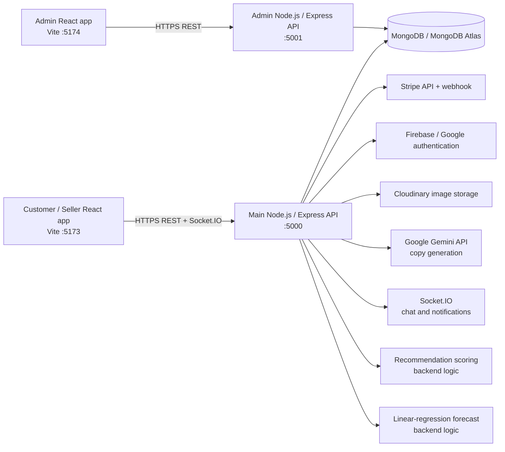

# Sakhi Bazaar

Sakhi Bazaar is a MERN-based marketplace for women entrepreneurs. It connects customers with seller-managed product listings while providing shopping, checkout, payments, order management, returns, messaging, notifications, market-price insights, and a separate administration application.

The application addresses the need for a focused digital marketplace where women-owned businesses can publish and manage products, communicate with customers, and monitor orders, while customers can discover products and manage the complete purchase lifecycle.

## Key Features

### Customer functionality

- Register and sign in with email/password.
- Sign in with Google through Firebase authentication.
- Browse active products, search, filter by category, subcategory, price, stock, and offers.
- View product details, seller information, ratings, and reviews.
- Add products to a cart, update quantities, remove items, clear the cart, and save items for later.
- Use a wishlist and product bookmarks.
- Continue using a guest cart and wishlist stored in browser `localStorage`; authenticated carts and wishlists use the API.
- Save and manage checkout addresses.
- Check out with cash on delivery or Stripe.
- View order history, payment history, shipment status, tracking details, and order timelines.
- Request returns with a reason and up to five defect images.
- Request refunds and view return/refund status.
- Receive and mark notifications as read.
- Chat with sellers for eligible order-related conversations.
- Submit, edit, and delete product reviews, including uploaded review media where supported by the UI/API.
- Update profile information, avatar, phone, address, password, theme, and language preferences.
- Access the About, Privacy Policy, and Terms and Conditions pages.

### Seller functionality

- Register and sign in as a seller.
- View a seller dashboard with products, inventory, product statistics, orders, payments, and profile data.
- Create, edit, and delete owned product listings.
- Manage titles, descriptions, categories, subcategories, prices, offers, stock status, stock quantity, SKUs, tags, delivery locations, marketing captions, and multiple images.
- Upload product images to Cloudinary through the backend.
- Generate product descriptions and marketing captions with Google Gemini.
- View relevant customer orders and update order/shipment statuses and timelines.
- Send and receive customer messages for order-related conversations.

### Admin functionality

The admin application is a separate React frontend and Express API.

- Admin-only login.
- Platform overview metrics and analytics.
- View, update status for, and delete customers and sellers.
- Approve, suspend, or otherwise manage seller account status through the admin API.
- Review, activate, flag, and delete products.
- View orders and update order statuses.
- Create, edit, and delete categories.
- Review and process return and refund requests.
- View notifications and administrative activity data.
- Inspect and edit market-price records.
- Generate revenue reports with date filtering.
- Switch the admin dashboard between light and dark themes.

### Product, catalog, and recommendation functionality

- Active product listing and detail endpoints.
- Text search over product titles and descriptions.
- Category and price filtering, stock and offer filters, and category statistics.
- Product reviews with ratings and media upload support.
- Product recommendations at `GET /api/products/:id/recommendations`.
- Recommendations are calculated by backend scoring logic using shared tags, category match, purchase count, popularity rank, and delivery-location match. They are not produced by a separately trained model.

### Cart, checkout, orders, and payments

- Authenticated cart persistence with quantity updates, save-for-later, clear-cart, and move-to-wishlist operations.
- Server-side order creation and price recalculation from database product prices.
- Cash-on-delivery payment records.
- Stripe PaymentIntent creation, confirmation, payment configuration, refund handling, and webhook processing.
- Order history, seller/admin status updates, shipment tracking, tracking numbers, carriers, and shipment timelines.

### Returns, refunds, notifications, and communication

- Embedded return and refund request workflows on orders.
- Customer return requests with defect-image uploads.
- Seller/admin actions to approve or reject returns and process, complete, or fail refunds.
- User notifications with unread/read state.
- Socket.IO support for real-time chat and user notification delivery.
- Conversation and message persistence through MongoDB.

### Market-price functionality

- Public market-price and market-trend endpoints.
- Category-level average, minimum, maximum, listing count, trend, and reference-range information derived from active marketplace listings when listings exist.
- Curated seeded benchmark records and seasonal pricing data when listing data is unavailable.
- A simple linear-regression forecast over available observations, labeled by the API with its model, horizon, predicted price, slope, change percentage, and confidence.
- The API explicitly marks the returned data as non-live. It does not currently connect to an external market-price provider.

## Technologies Used

### Frontend

| Area | Technologies |
| --- | --- |
| Customer and seller app | React 19, React DOM, React Router DOM, Vite |
| Admin app | React 18, React DOM, React Router DOM, Vite |
| Styling and UI | Tailwind CSS, `@tailwindcss/vite`, Lucide React |
| HTTP and realtime clients | Axios, Socket.IO Client |
| Payments | Stripe.js and React Stripe.js |
| Client authentication | Firebase Web SDK |

### Backend

| Area | Technologies |
| --- | --- |
| Main API | Node.js, Express 4 |
| Admin API | Node.js, Express 4 |
| Database access | Mongoose 8 |
| File uploads | Multer |
| Realtime transport | Socket.IO |
| Configuration | `dotenv` |

### Database

- MongoDB or MongoDB Atlas through Mongoose.
- Main models include users, products, orders, carts, payments, shipments, conversations, messages, notifications, bookmarks, categories, market prices, and market trends.
- Wishlist entries are stored on the user document. Return and refund requests are stored on the order document rather than separate collections.

### Authentication and security

- JWT bearer-token authentication with `jsonwebtoken`.
- Password hashing with `bcryptjs`.
- Firebase Google ID-token verification using Firebase project identity and Google public certificates.
- Role checks for `customer`, `seller`, and `admin`.
- CORS allowlisting, disabled `X-Powered-By`, response security headers, upload type/size limits, and Stripe webhook signature verification when configured.

### APIs and external services

- Stripe for online payments, PaymentIntents, refunds, and webhooks.
- Cloudinary for product image storage.
- Google Gemini through `@google/generative-ai` for seller description and caption generation.
- Nodemailer for configured email delivery workflows.
- Firebase for Google authentication.

### ML and data technologies

- Gemini generative AI is used for seller-facing copy generation.
- Product recommendations use deterministic application scoring.
- Market forecasting uses a small linear-regression calculation in the backend.
- No Python package, model-training pipeline, notebook, or standalone ML service is included in this repository.

### Deployment technologies

- Vite production builds for both frontends.
- Node.js `npm start` processes for both APIs.
- MongoDB Atlas, Cloudinary, Stripe, Firebase, and Google Gemini can be supplied as hosted services.
- The repository contains no Dockerfile, Kubernetes manifest, Terraform/Bicep configuration, or CI/CD workflow.

## System Architecture



The main frontend contains customer and seller routes. The admin frontend is isolated behind its own login and calls the admin API. Both backend applications use MongoDB models; the admin backend imports the shared model tree from the repository, so it is not currently a fully independent package.

## Project Structure

```text
SakhiBazaar_New/
├── backend/                         # Main customer/seller API and Socket.IO server
│   ├── server.js                    # Express setup, route mounting, health endpoint, Socket.IO
│   ├── config/                      # MongoDB, Firebase, Gemini, Cloudinary, and socket setup
│   ├── controllers/                 # Authentication, catalog, cart, orders, payments, and more
│   ├── middleware/                  # JWT roles, errors, and upload validation
│   ├── models/                      # Mongoose schemas
│   ├── routes/                      # Main API route groups
│   ├── utils/pricing.js             # Server-side order pricing calculations
│   └── .env.example                 # Main backend environment template
├── frontend/                        # Customer and seller React/Vite application
│   ├── src/App.jsx                  # Application routes and providers
│   ├── src/pages/                   # Login, shopping, checkout, dashboards, chat, and order views
│   ├── src/components/              # Layouts, cards, filters, tracking, navigation, and UI
│   ├── src/context/                 # Auth, cart, wishlist, theme, language, and socket state
│   ├── src/config/                  # API and Firebase client configuration
│   ├── vite.config.js               # Vite development proxy and Socket.IO proxy
│   └── .env.example                 # Main frontend environment template
├── admin/
│   ├── backend/                     # Separate admin Express API on port 5001
│   │   ├── server.js                # Admin API startup and route mounting
│   │   ├── controllers/             # Admin moderation, analytics, reports, and market actions
│   │   ├── middleware/              # Admin JWT and role protection
│   │   └── routes/adminRoutes.js    # Admin route groups
│   └── frontend/                    # Separate admin React/Vite dashboard on port 5174
│       ├── src/pages/               # Admin login and dashboard
│       ├── src/context/             # Admin authentication state
│       └── vite.config.js           # Admin and main API development proxies
├── .env.example                     # Combined deployment-oriented variable template
├── package.json                     # Root package metadata and shared location packages
└── README.md
```

## Screen Recording / Demo

### Project Demo

https://github.com/user-attachments/assets/7f9e4dcc-cbcf-4cf2-b885-f4970b8cf4e6


## API Overview

The main backend registers the route groups below under `/api`. Most groups are also mounted at legacy paths without `/api`; use the `/api` paths for new integrations. All protected routes require `Authorization: Bearer <jwt>` unless stated otherwise.

| Route group | Access | Purpose |
| --- | --- | --- |
| `/api/auth` | Public and protected | Registration, login, Google login, logout, profile, preferences, password reset/OTP, saved addresses, and admin user operations |
| `/api/products` | Public and role-protected | Listing, search, filtering, category statistics, product detail, recommendations, seller CRUD, and reviews |
| `/api/cart` | Protected | Cart retrieval, add/update/remove/clear, save-for-later, and move-to-wishlist |
| `/api/wishlist` | Protected | Wishlist retrieval and item management |
| `/api/bookmarks` | Protected | Product bookmark retrieval and management |
| `/api/orders` | Protected | Create orders, order history, tracking, and seller/admin status updates |
| `/api/payments` | Protected | Payment records, mock payment, Stripe intent/confirmation, configuration, and refunds |
| `/api/webhooks/stripe` | Stripe webhook | Stripe event processing; mounted before JSON parsing for raw-body signature verification |
| `/api/return-refund` | Protected | Return status, return requests, refund requests, and seller/admin processing actions |
| `/api/shipments` | Protected | Role-filtered shipment data and shipment updates |
| `/api/reviews` | Public and protected | Product review operations |
| `/api/notifications` | Protected | Retrieve, create, and mark notifications as read |
| `/api/chat` | Protected | Conversations and messages |
| `/api/market` | Public | Market prices and market trends |
| `/api/ai` | Seller only | Gemini product-description and marketing-caption generation |
| `/api/health` | Public | API, database state, uptime, and environment health information |


### Admin API

The admin backend registers the following groups under `/api/admin` and also mounts them under `/admin`:

| Route group | Purpose |
| --- | --- |
| `/auth/login` | Admin login |
| `/users` | User listing, status changes, and deletion |
| `/products` | Product listing, moderation status, and deletion |
| `/orders` | Order listing and status updates |
| `/analytics` | Platform analytics |
| `/categories` | Category CRUD |
| `/returns` | Return listing and processing |
| `/refunds` | Refund listing and processing |
| `/notifications` | Admin notification/activity data |
| `/market-data` | Market data inspection and price updates |
| `/reports/revenue` | Revenue reports |

## User Roles & Permissions

| Role | Main access |
| --- | --- |
| Customer | Public catalog, authenticated cart/wishlist/bookmarks, checkout, payments, orders, tracking, reviews, returns/refunds, notifications, profile/preferences, and order-related chat |
| Seller | Seller dashboard, owned product CRUD, image uploads, inventory and listing data, Gemini copy generation, relevant orders/payments, status and shipment updates, notifications, and customer chat |
| Admin | Separate admin login and protected moderation API for users, sellers, products, orders, categories, returns, refunds, market data, notifications, analytics, and revenue reports |

The main API uses JWT role middleware and ownership checks. Product updates/deletions are restricted to the owning seller or an admin, and seller/admin order, shipment, payment, and return/refund operations are checked by their controllers. The admin frontend is separately protected by its admin authentication context.
