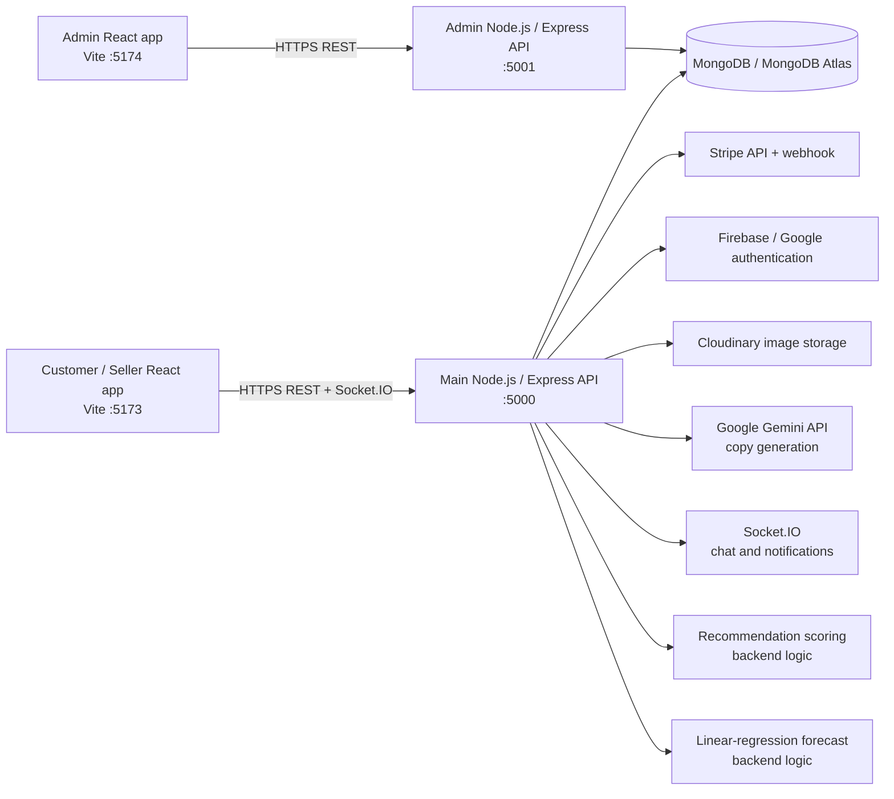

# Sakhi Bazaar

Sakhi Bazaar is a MERN-based marketplace for women entrepreneurs. It connects customers with seller-managed product listings while providing shopping, checkout, payments, order management, returns, messaging, notifications, market-price insights, and a separate administration application.

The application addresses the need for a focused digital marketplace where women-owned businesses can publish and manage products, communicate with customers, and monitor orders, while customers can discover products and manage the complete purchase lifecycle.

> **Implementation note:** This README describes the functionality currently represented in the repository. Market data is marked as non-live by the API, recommendations use an application scoring function, and there is no separate ML service in the project.

## Key Features

### Customer functionality

- Register and sign in with email/password.
- Sign in with Google through Firebase authentication.
- Browse active products, search, filter by category, subcategory, price, stock, and offers.
- View product details, seller information, ratings, and reviews.
- Add products to a cart, update quantities, remove items, clear the cart, and save items for later.
- Use a wishlist and product bookmarks.
- Continue using a guest cart and wishlist stored in browser `localStorage`; authenticated carts and wishlists use the API.
- Save and manage checkout addresses.
- Check out with cash on delivery or Stripe.
- View order history, payment history, shipment status, tracking details, and order timelines.
- Request returns with a reason and up to five defect images.
- Request refunds and view return/refund status.
- Receive and mark notifications as read.
- Chat with sellers for eligible order-related conversations.
- Submit, edit, and delete product reviews, including uploaded review media where supported by the UI/API.
- Update profile information, avatar, phone, address, password, theme, and language preferences.
- Access the About, Privacy Policy, and Terms and Conditions pages.

### Seller functionality

- Register and sign in as a seller.
- View a seller dashboard with products, inventory, product statistics, orders, payments, and profile data.
- Create, edit, and delete owned product listings.
- Manage titles, descriptions, categories, subcategories, prices, offers, stock status, stock quantity, SKUs, tags, delivery locations, marketing captions, and multiple images.
- Upload product images to Cloudinary through the backend.
- Generate product descriptions and marketing captions with Google Gemini.
- View relevant customer orders and update order/shipment statuses and timelines.
- Send and receive customer messages for order-related conversations.

### Admin functionality

The admin application is a separate React frontend and Express API.

- Admin-only login.
- Platform overview metrics and analytics.
- View, update status for, and delete customers and sellers.
- Approve, suspend, or otherwise manage seller account status through the admin API.
- Review, activate, flag, and delete products.
- View orders and update order statuses.
- Create, edit, and delete categories.
- Review and process return and refund requests.
- View notifications and administrative activity data.
- Inspect and edit market-price records.
- Generate revenue reports with date filtering.
- Switch the admin dashboard between light and dark themes.

### Product, catalog, and recommendation functionality

- Active product listing and detail endpoints.
- Text search over product titles and descriptions.
- Category and price filtering, stock and offer filters, and category statistics.
- Product reviews with ratings and media upload support.
- Product recommendations at `GET /api/products/:id/recommendations`.
- Recommendations are calculated by backend scoring logic using shared tags, category match, purchase count, popularity rank, and delivery-location match. They are not produced by a separately trained model.

### Cart, checkout, orders, and payments

- Authenticated cart persistence with quantity updates, save-for-later, clear-cart, and move-to-wishlist operations.
- Server-side order creation and price recalculation from database product prices.
- Cash-on-delivery payment records.
- Stripe PaymentIntent creation, confirmation, payment configuration, refund handling, and webhook processing.
- Order history, seller/admin status updates, shipment tracking, tracking numbers, carriers, and shipment timelines.

### Returns, refunds, notifications, and communication

- Embedded return and refund request workflows on orders.
- Customer return requests with defect-image uploads.
- Seller/admin actions to approve or reject returns and process, complete, or fail refunds.
- User notifications with unread/read state.
- Socket.IO support for real-time chat and user notification delivery.
- Conversation and message persistence through MongoDB.

### Market-price functionality

- Public market-price and market-trend endpoints.
- Category-level average, minimum, maximum, listing count, trend, and reference-range information derived from active marketplace listings when listings exist.
- Curated seeded benchmark records and seasonal pricing data when listing data is unavailable.
- A simple linear-regression forecast over available observations, labeled by the API with its model, horizon, predicted price, slope, change percentage, and confidence.
- The API explicitly marks the returned data as non-live. It does not currently connect to an external market-price provider.

## Technologies Used

### Frontend

| Area | Technologies |
| --- | --- |
| Customer and seller app | React 19, React DOM, React Router DOM, Vite |
| Admin app | React 18, React DOM, React Router DOM, Vite |
| Styling and UI | Tailwind CSS, `@tailwindcss/vite`, Lucide React |
| HTTP and realtime clients | Axios, Socket.IO Client |
| Payments | Stripe.js and React Stripe.js |
| Client authentication | Firebase Web SDK |

### Backend

| Area | Technologies |
| --- | --- |
| Main API | Node.js, Express 4 |
| Admin API | Node.js, Express 4 |
| Database access | Mongoose 8 |
| File uploads | Multer |
| Realtime transport | Socket.IO |
| Configuration | `dotenv` |

### Database

- MongoDB or MongoDB Atlas through Mongoose.
- Main models include users, products, orders, carts, payments, shipments, conversations, messages, notifications, bookmarks, categories, market prices, and market trends.
- Wishlist entries are stored on the user document. Return and refund requests are stored on the order document rather than separate collections.

### Authentication and security

- JWT bearer-token authentication with `jsonwebtoken`.
- Password hashing with `bcryptjs`.
- Firebase Google ID-token verification using Firebase project identity and Google public certificates.
- Role checks for `customer`, `seller`, and `admin`.
- CORS allowlisting, disabled `X-Powered-By`, response security headers, upload type/size limits, and Stripe webhook signature verification when configured.

### APIs and external services

- Stripe for online payments, PaymentIntents, refunds, and webhooks.
- Cloudinary for product image storage.
- Google Gemini through `@google/generative-ai` for seller description and caption generation.
- Nodemailer for configured email delivery workflows.
- Firebase for Google authentication.

### ML and data technologies

- Gemini generative AI is used for seller-facing copy generation.
- Product recommendations use deterministic application scoring.
- Market forecasting uses a small linear-regression calculation in the backend.
- No Python package, model-training pipeline, notebook, or standalone ML service is included in this repository.

### Deployment technologies

- Vite production builds for both frontends.
- Node.js `npm start` processes for both APIs.
- MongoDB Atlas, Cloudinary, Stripe, Firebase, and Google Gemini can be supplied as hosted services.
- The repository contains no Dockerfile, Kubernetes manifest, Terraform/Bicep configuration, or CI/CD workflow.

## System Architecture



The main frontend contains customer and seller routes. The admin frontend is isolated behind its own login and calls the admin API. Both backend applications use MongoDB models; the admin backend imports the shared model tree from the repository, so it is not currently a fully independent package.

## Project Structure

```text
SakhiBazaar_New/
├── backend/                         # Main customer/seller API and Socket.IO server
│   ├── server.js                    # Express setup, route mounting, health endpoint, Socket.IO
│   ├── config/                      # MongoDB, Firebase, Gemini, Cloudinary, and socket setup
│   ├── controllers/                 # Authentication, catalog, cart, orders, payments, and more
│   ├── middleware/                  # JWT roles, errors, and upload validation
│   ├── models/                      # Mongoose schemas
│   ├── routes/                      # Main API route groups
│   ├── utils/pricing.js             # Server-side order pricing calculations
│   └── .env.example                 # Main backend environment template
├── frontend/                        # Customer and seller React/Vite application
│   ├── src/App.jsx                  # Application routes and providers
│   ├── src/pages/                   # Login, shopping, checkout, dashboards, chat, and order views
│   ├── src/components/              # Layouts, cards, filters, tracking, navigation, and UI
│   ├── src/context/                 # Auth, cart, wishlist, theme, language, and socket state
│   ├── src/config/                  # API and Firebase client configuration
│   ├── vite.config.js               # Vite development proxy and Socket.IO proxy
│   └── .env.example                 # Main frontend environment template
├── admin/
│   ├── backend/                     # Separate admin Express API on port 5001
│   │   ├── server.js                # Admin API startup and route mounting
│   │   ├── controllers/             # Admin moderation, analytics, reports, and market actions
│   │   ├── middleware/              # Admin JWT and role protection
│   │   └── routes/adminRoutes.js    # Admin route groups
│   └── frontend/                    # Separate admin React/Vite dashboard on port 5174
│       ├── src/pages/               # Admin login and dashboard
│       ├── src/context/             # Admin authentication state
│       └── vite.config.js           # Admin and main API development proxies
├── .env.example                     # Combined deployment-oriented variable template
├── package.json                     # Root package metadata and shared location packages
└── README.md
```

## Screenshots

Replace each placeholder with a committed image path, for example ``.

### Home Page

<!-- Add screenshot here -->

### Product Listing and Filters

<!-- Add screenshot here -->

### Product Details and Reviews

<!-- Add screenshot here -->

### Cart

<!-- Add screenshot here -->

### Checkout and Payment

<!-- Add screenshot here -->

### Customer Dashboard

<!-- Add screenshot here -->

### Orders and Shipment Tracking

<!-- Add screenshot here -->

### Return and Refund Screen

<!-- Add screenshot here -->

### Customer Chat and Notifications

<!-- Add screenshot here -->

### Seller Dashboard

<!-- Add screenshot here -->

### Seller Product Management

<!-- Add screenshot here -->

### Admin Dashboard

<!-- Add screenshot here -->

### Market-Price Dashboard

<!-- Add screenshot here -->

### Product Recommendation Section

<!-- Add screenshot here -->

### Login and Registration

<!-- Add screenshot here -->

## Screen Recording / Demo

### Project Demo

<!-- Add GitHub-hosted video, YouTube/Loom link, or GIF/demo recording here -->

## Installation & Setup

### Prerequisites

- Node.js 18 or newer.
- npm.
- MongoDB or MongoDB Atlas.
- Firebase project if Google sign-in is enabled.
- Cloudinary account if image uploads are enabled.
- Stripe account and webhook endpoint if Stripe payments are enabled.
- Google Gemini API key if seller copy generation is enabled.

### 1. Clone the repository

```powershell
git clone https://github.com/Sheema-Md/SakhiBazaar-MERN.git
cd SakhiBazaar-MERN
```

### 2. Install dependencies

Install each application independently because each application has its own package manifest:

```powershell
cd backend
npm install

cd ..\frontend
npm install

cd ..\admin\backend
npm install

cd ..\frontend
npm install
```

The root `package.json` contains the `country-state-city` and `india-states-districts` dependencies. Install it as well when working with root-level scripts or packages:

```powershell
cd <repository-root>
npm install
```

### 3. Create environment files

Copy the committed templates to local `.env` files and fill them with local values:

```text
backend/.env.example        -> backend/.env
frontend/.env.example       -> frontend/.env
admin/backend/.env.example  -> admin/backend/.env
admin/frontend/.env.example -> admin/frontend/.env
```

Do not commit `.env` files. The repository ignores environment files while allowing `.env.example` templates.

### 4. Configure MongoDB

Set `MONGO_URI` in both backend environment files. The main and admin APIs are designed to use the same MongoDB connection when they share the same database. Ensure the database user, network access, and connection string are valid before starting either API.

### 5. Run the main backend

In a terminal:

```powershell
cd backend
npm run dev
```

The main API defaults to `http://localhost:5000`. It exposes `GET /api/health` for a health check.

### 6. Run the customer/seller frontend

In a second terminal:

```powershell
cd frontend
npm run dev
```

The customer/seller frontend defaults to the Vite port `5173`. Set `VITE_DEV_API_TARGET=http://localhost:5000` to use the configured development proxy, or set `VITE_API_URL` directly.

### 7. Run the admin backend

In a third terminal:

```powershell
cd admin\backend
npm run dev
```

The admin API defaults to `http://localhost:5001` and is mounted under `/api/admin`.

### 8. Run the admin frontend

In a fourth terminal:

```powershell
cd admin\frontend
npm run dev
```

The admin frontend uses port `5174`. Set `VITE_DEV_ADMIN_API_TARGET=http://localhost:5001` and `VITE_DEV_API_TARGET=http://localhost:5000` when using local API proxies.

### 9. Build and lint

```powershell
cd frontend
npm run lint
npm run build

cd ..\admin\frontend
npm run build
```

The backend packages provide `npm start` for production Node.js startup and `npm run dev` for Nodemon development startup.

## Environment Variables

The following are variable names only. Use the repository `.env.example` files as the authoritative templates and supply real values locally or through the deployment platform.

### Main backend: `backend/.env`

```dotenv
NODE_ENV=production
PORT=5000
MONGO_URI=<mongodb-connection-string>
JWT_SECRET=<long-random-secret>
GEMINI_API_KEY=<google-gemini-api-key>
CLOUDINARY_CLOUD_NAME=<cloudinary-cloud-name>
CLOUDINARY_API_KEY=<cloudinary-api-key>
CLOUDINARY_API_SECRET=<cloudinary-api-secret>
FIREBASE_PROJECT_ID=<firebase-project-id>
```

The combined root template also defines these optional/deployment variables for the main API:

```dotenv
CORS_ORIGINS=<comma-separated-allowed-origins>
INITIAL_ADMIN_EMAIL=<admin-email>
INITIAL_ADMIN_PASSWORD=<initial-admin-password>
INITIAL_ADMIN_NAME=<admin-name>
INITIAL_ADMIN_USERNAME=<admin-username>
INITIAL_ADMIN_PHONE=<admin-phone>
INITIAL_ADMIN_AADHAAR=<admin-identifier>
STRIPE_SECRET_KEY=<stripe-secret-key>
STRIPE_PUBLISHABLE_KEY=<stripe-publishable-key>
STRIPE_WEBHOOK_SECRET=<stripe-webhook-signing-secret>
SMTP_HOST=<smtp-host>
SMTP_PORT=<smtp-port>
SMTP_SECURE=<true-or-false>
SMTP_USER=<smtp-username>
SMTP_PASS=<smtp-password>
```

### Main frontend: `frontend/.env`

```dotenv
VITE_API_URL=https://api.example.com/api
VITE_SOCKET_URL=https://api.example.com
VITE_DEV_API_TARGET=http://localhost:5000
VITE_ADMIN_APP_URL=https://admin.example.com
VITE_FIREBASE_API_KEY=<firebase-web-api-key>
VITE_FIREBASE_AUTH_DOMAIN=<firebase-auth-domain>
VITE_FIREBASE_PROJECT_ID=<firebase-project-id>
VITE_FIREBASE_STORAGE_BUCKET=<firebase-storage-bucket>
VITE_FIREBASE_MESSAGING_SENDER_ID=<firebase-messaging-sender-id>
VITE_FIREBASE_APP_ID=<firebase-app-id>
```

### Admin backend: `admin/backend/.env`

```dotenv
NODE_ENV=production
PORT=5001
MONGO_URI=<mongodb-connection-string>
JWT_SECRET=<long-random-secret>
CORS_ORIGINS=<admin-frontend-origin>
INITIAL_ADMIN_EMAIL=<admin-email>
INITIAL_ADMIN_PASSWORD=<initial-admin-password>
INITIAL_ADMIN_NAME=<admin-name>
INITIAL_ADMIN_USERNAME=<admin-username>
INITIAL_ADMIN_PHONE=<admin-phone>
INITIAL_ADMIN_AADHAAR=<admin-identifier>
```

### Admin frontend: `admin/frontend/.env`

```dotenv
VITE_ADMIN_API_URL=https://admin-api.example.com/api/admin
VITE_API_URL=https://api.example.com/api
VITE_DEV_ADMIN_API_TARGET=http://localhost:5001
VITE_DEV_API_TARGET=http://localhost:5000
```

## API Overview

The main backend registers the route groups below under `/api`. Most groups are also mounted at legacy paths without `/api`; use the `/api` paths for new integrations. All protected routes require `Authorization: Bearer <jwt>` unless stated otherwise.

| Route group | Access | Purpose |
| --- | --- | --- |
| `/api/auth` | Public and protected | Registration, login, Google login, logout, profile, preferences, password reset/OTP, saved addresses, and admin user operations |
| `/api/products` | Public and role-protected | Listing, search, filtering, category statistics, product detail, recommendations, seller CRUD, and reviews |
| `/api/cart` | Protected | Cart retrieval, add/update/remove/clear, save-for-later, and move-to-wishlist |
| `/api/wishlist` | Protected | Wishlist retrieval and item management |
| `/api/bookmarks` | Protected | Product bookmark retrieval and management |
| `/api/orders` | Protected | Create orders, order history, tracking, and seller/admin status updates |
| `/api/payments` | Protected | Payment records, mock payment, Stripe intent/confirmation, configuration, and refunds |
| `/api/webhooks/stripe` | Stripe webhook | Stripe event processing; mounted before JSON parsing for raw-body signature verification |
| `/api/return-refund` | Protected | Return status, return requests, refund requests, and seller/admin processing actions |
| `/api/shipments` | Protected | Role-filtered shipment data and shipment updates |
| `/api/reviews` | Public and protected | Product review operations |
| `/api/notifications` | Protected | Retrieve, create, and mark notifications as read |
| `/api/chat` | Protected | Conversations and messages |
| `/api/market` | Public | Market prices and market trends |
| `/api/ai` | Seller only | Gemini product-description and marketing-caption generation |
| `/api/health` | Public | API, database state, uptime, and environment health information |

### Admin API

The admin backend registers the following groups under `/api/admin` and also mounts them under `/admin`:

| Route group | Purpose |
| --- | --- |
| `/auth/login` | Admin login |
| `/users` | User listing, status changes, and deletion |
| `/products` | Product listing, moderation status, and deletion |
| `/orders` | Order listing and status updates |
| `/analytics` | Platform analytics |
| `/categories` | Category CRUD |
| `/returns` | Return listing and processing |
| `/refunds` | Refund listing and processing |
| `/notifications` | Admin notification/activity data |
| `/market-data` | Market data inspection and price updates |
| `/reports/revenue` | Revenue reports |

## User Roles & Permissions

| Role | Main access |
| --- | --- |
| Customer | Public catalog, authenticated cart/wishlist/bookmarks, checkout, payments, orders, tracking, reviews, returns/refunds, notifications, profile/preferences, and order-related chat |
| Seller | Seller dashboard, owned product CRUD, image uploads, inventory and listing data, Gemini copy generation, relevant orders/payments, status and shipment updates, notifications, and customer chat |
| Admin | Separate admin login and protected moderation API for users, sellers, products, orders, categories, returns, refunds, market data, notifications, analytics, and revenue reports |

The main API uses JWT role middleware and ownership checks. Product updates/deletions are restricted to the owning seller or an admin, and seller/admin order, shipment, payment, and return/refund operations are checked by their controllers. The admin frontend is separately protected by its admin authentication context.

## Deployment

The repository does not include infrastructure manifests, so deployment consists of building the two frontends and running the two Node.js API services with platform-managed environment variables.

### Frontends

For either frontend, configure the hosting platform to use the relevant directory as its project root and run:

```powershell
npm install
npm run build
```

Deploy the generated Vite `dist/` directory using the platform's static-site settings. Configure `VITE_API_URL`, `VITE_SOCKET_URL`, `VITE_ADMIN_APP_URL`, Firebase variables, and the admin proxy variables as appropriate for the target environment. Use HTTPS origins in production.

### Main API

Deploy `backend/` as a Node.js web service:

```powershell
npm install
npm start
```

Set `PORT`, `MONGO_URI`, `JWT_SECRET`, `CORS_ORIGINS`, and the credentials for any enabled Firebase, Cloudinary, Stripe, Gemini, and SMTP integrations. Configure a health check against `/api/health`.

### Admin API

Deploy `admin/backend/` as a second Node.js web service:

```powershell
npm install
npm start
```

Set the admin backend variables and ensure the deployment includes access to the repository's shared `backend/models` tree, because the current admin controller imports shared models by repository-relative paths. Alternatively, package or restructure those shared models before deploying the admin API as a completely isolated service.

### Database and external services

- Use MongoDB Atlas or another reachable MongoDB deployment for both APIs.
- Configure Cloudinary for product image uploads.
- Configure Stripe webhook delivery to the deployed main API's `/api/webhooks/stripe` endpoint.
- Configure Firebase authorized domains and matching frontend credentials for Google sign-in.
- Configure Gemini and SMTP only when those features are required.
- Keep all secrets in the hosting provider's secret/environment-variable store.

## Future Improvements

These items are not presented as completed features in the current codebase:

- Replace seeded/curated market benchmarks with verified external or partner market data.
- Expand market history and forecasting beyond the current simple linear-regression calculation.
- Add a dedicated trained recommendation or forecasting service if product requirements justify it.
- Implement the currently commented-out Gemini translation endpoint and establish centralized internationalization.
- Add automated backend and frontend test suites, end-to-end tests, and CI checks.
- Add containerization and infrastructure-as-code if repeatable deployments are required.
- Further isolate and package shared models for independent admin API deployment.
- Review and harden realtime socket identity handling, webhook configuration requirements, and conversation authorization before production exposure.

## Contributing

1. Fork the repository and create a focused feature branch.
2. Install dependencies for the application(s) you are changing.
3. Create local `.env` files from the committed templates; never commit secrets.
4. Keep changes scoped to the relevant frontend, backend, or admin application.
5. Run the relevant frontend lint/build commands and manually verify affected API flows.
6. Open a pull request describing the change, setup requirements, and validation performed.

## License

There is currently no repository-wide `LICENSE` file. The main and admin backend package manifests specify the ISC package license, but that does not replace a clearly committed repository license. Add a `LICENSE` file before distributing the project if a specific open-source or academic license is required.
