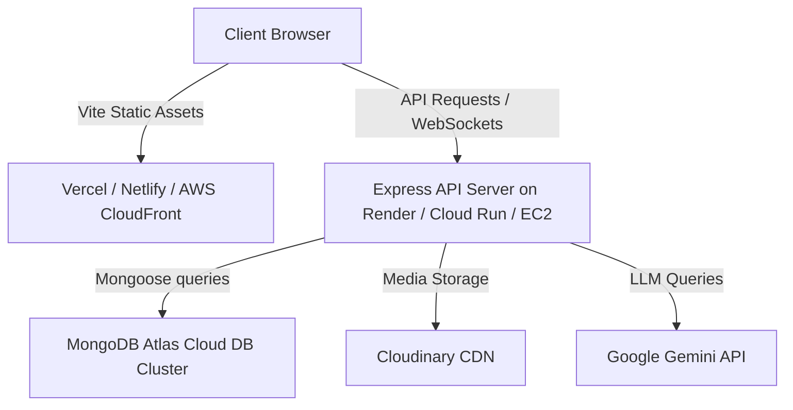

# Sakhi Bazaar: Technical Interview Preparation Guide

This guide covers the core architectural, backend, frontend, database, AI, and deployment questions regarding the **Sakhi Bazaar** application. It serves as an intensive reference for technical discussions and reviews.

---

## Table of Contents
1. [What is your folder structure?](#1-what-is-your-folder-structure)
2. [How does authentication work?](#2-how-does-authentication-work)
3. [Which JWT flow do you use?](#3-which-jwt-flow-do-you-use)
4. [Which APIs have you created?](#4-which-apis-have-you-created)
5. [Which MongoDB collections do you have?](#5-which-mongodb-collections-do-you-have)
6. [How exactly does Gemini generate descriptions?](#6-how-exactly-does-gemini-generate-descriptions)
7. [How does market price analysis work?](#7-how-does-market-price-analysis-work)
8. [How is role-based access implemented (Admin/Seller/Buyer)?](#8-how-is-role-based-access-implemented-adminsellerbuyer)
9. [How did you make the application responsive?](#9-how-did-you-make-the-application-responsive)
10. [How would you deploy it?](#10-how-would-you-deploy-it)

---

## 1. What is your folder structure?

The codebase is organized as a monorepo consisting of the main marketplace application and a standalone administrative system:

```text
SakhiBazaar_New/
├── backend/                  # Main Express & Node.js REST API Server
│   ├── config/               # Database connection and socket configurations
│   ├── controllers/          # Request handler controllers (Auth, AI, Products, etc.)
│   ├── middleware/           # Auth validation, upload management
│   ├── models/               # MongoDB models & Mongoose schemas
│   ├── routes/               # API endpoint routing declarations
│   └── server.js             # Main server startup entry point
├── frontend/                 # Main Buyer Storefront & Seller Dashboard React App
│   ├── public/               # Static public assets
│   ├── src/
│   │   ├── components/       # Reusable UI components (Navbar, Filters, Cards, etc.)
│   │   ├── context/          # React contexts (Auth, Cart, Language, Theme)
│   │   ├── pages/            # View pages (SellerDashboard, Login, ProductDetails)
│   │   ├── services/         # API connection handlers
│   │   └── main.jsx          # Vite React entry point
│   ├── package.json
│   └── vite.config.js
├── admin/                    # Standalone Administrative Portal
│   ├── backend/              # Standalone Admin Node.js REST API Server
│   │   ├── controllers/      # Admin vetting, product moderation, analytics controllers
│   │   ├── models/           # Shared models (User, Product, Order)
│   │   ├── routes/           # Admin router definitions
│   │   └── server.js         # Admin server entry point (seeds default admin)
│   └── frontend/             # Standalone Admin Dashboard React client application
└── srs.md                    # Software Requirements Specification document
```

### Key Highlights:
* **Separation of Concerns:** Split cleanly into `frontend` (Vite, React 19, Tailwind CSS v4) and `backend` (Express, Node.js).
* **Decoupled Admin Panel:** The `admin` subdirectory functions as a completely isolated application (with its own standalone admin backend and admin frontend) that shares access to the same MongoDB database, enabling secure and specialized administration without overloading the main application APIs.

---

## 2. How does authentication work?

Authentication is powered by a stateless JWT token validation model combined with secure password hashing:

### Registration and Verification
* **Traditional Registration:** Users sign up via `POST /api/auth/register`. Input fields are validated on the backend:
  * **Phone Numbers:** Checked to verify they are exactly 10 digits.
  * **Aadhaar Numbers:** Checked to verify they are exactly 12 digits.
  * **Password Strength:** Must be at least 8 characters, with 1 uppercase, 1 lowercase, 1 number, and 1 special character.
* **Password Hashing:** Passwords are automatically salted and hashed using `bcryptjs` before insertion into MongoDB, triggered by a Mongoose pre-save middleware in `User.js`.

### Authentication Flows
* **Credentials Log In:** Users submit credentials via `POST /api/auth/login` (supports logging in using either **Email** or **Username**). The backend verifies the password hash using `bcryptjs`.
* **Google Single Sign-In (SSO):** The frontend authenticates via Firebase Auth, retrieving the user’s Google profile. The client then requests `POST /api/auth/google-login`. If no matching email exists, the backend creates a user record with a strong, random password and an automatically generated username.
* **OTP Password Recovery:** `/api/auth/forgot-password` generates a 6-digit numeric OTP code, saves it to the database with a 10-minute expiry time, and logs it to the server console. After verification, users can trigger `/api/auth/reset-password` to submit their new password.

### Route Protection Middleware
Once authenticated, the backend signs a JSON Web Token:
```javascript
const generateToken = (id) => {
  return jwt.sign({ id }, process.env.JWT_SECRET, { expiresIn: '30d' });
};
```
The token is returned to the client and included in the header of subsequent requests:
`Authorization: Bearer <token>`

The `protect` middleware decodes this token using `jwt.verify()`, retrieves the user's details from MongoDB (excluding the password), and attaches them to `req.user` to authorize requests.

---

## 3. Which JWT flow do you use?

The application implements a stateless **Token-Based Bearer Token Flow via HTTP Headers**:

1. **Token Generation:** Upon successful registration, standard login, or Google sign-in, the server signs a JWT token payload containing the user's MongoDB `_id` using the secret key (`JWT_SECRET`).
2. **Client-Side Storage:** The backend returns this token in the JSON response payload. The React client intercepts this response and stores the token locally (typically in `localStorage` or inside the React AuthContext state).
3. **Authorization Header:** For all subsequent requests to protected endpoints, the client attaches the JWT string in the standard HTTP `Authorization` header:
   ```http
   Authorization: Bearer <JWT_token_string>
   ```
4. **Validation:** The server parses the header using Express middleware, verifying authenticity. No session state is maintained on the server, making the architecture highly scalable and robust against session hijacking.

---

## 4. Which APIs have you created?

The platform consists of two distinct backend API services:

### A. Main Marketplace API (`backend` on Port 5000)

* **User Authentication & Preferences (`/api/auth`)**
  * `POST /register` – Create email/password account (with phone/Aadhaar validation).
  * `POST /login` – Log in using email or username.
  * `POST /google-login` – Login/Signup via Google federated credentials.
  * `POST /logout` – De-authorizes active client session.
  * `GET /profile` | `PUT /profile` | `DELETE /profile` – Get, edit, or delete active user profiles.
  * `GET /preferences` | `PUT /preferences` – Retrieve/update UI preferences (theme, language).
  * `POST /forgot-password` | `/verify-otp` | `/reset-password` – OTP-based password reset loop.
  * `GET /users` | `PUT /users/:id` | `DELETE /users/:id` – Admin-level platform user controls.
* **Products and Catalog (`/api/products`)**
  * `GET /` – Fetch all active products in the marketplace.
  * `GET /filter` – Multi-select filtering (categories, subcategories, stock, offer status, price range).
  * `GET /search` – Text-index keyword query to search product titles, tags, and descriptions.
  * `GET /stats/category` – Computes average, min, and max product prices within a category.
  * `GET /:id` – Fetch single product details.
  * `POST /` – Add a new product (Sellers only; handles Cloudinary image uploads).
  * `GET /seller/me` – Retrieve products belonging to the logged-in seller.
  * `PUT /:id` – Update product details.
  * `DELETE /:id` – Delete product listing.
* **Generative AI Assistant (`/api/ai`)**
  * `POST /generate-description` – Generates storytelling product descriptions via Gemini.
  * `POST /generate-caption` – Generates short, emoji-rich promotional captions with hashtags.
* **Market pricing benchmarks (`/api/market`)**
  * `GET /market-prices` – Commodity wholesale raw materials prices.
  * `GET /market-trends` – Category-wide supply/demand metrics.
* **Social & Transactions**
  * **Chat (`/api/chat`):** Fetch/create conversations and send messages between buyers and sellers.
  * **Cart (`/api/cart`):** Add, update quantities, remove, save for later, or move items to wishlist.
  * **Wishlist & Bookmarks (`/api/wishlist` & `/api/bookmarks`):** Product favorites list.
  * **Orders & Shipments (`/api/orders` & `/api/shipments`):** Order routing and shipping tracking status.
  * **Payments (`/api/payments`):** Creates Stripe intent/secret and logs payments.
  * **Reviews (`/api/reviews`):** Manage product reviews and ratings.

### B. Standalone Administrative API (`admin/backend` on Port 5001)

* `POST /auth/register` & `POST /auth/login` – Admin credentials onboarding.
* `GET /users` | `PUT /users/:id/status` | `DELETE /users/:id` – Appoint roles and vet seller statuses (Pending, Approved, Suspended).
* `GET /products` | `PUT /products/:id/status` | `DELETE /products/:id` – Flag, suspend, or reactivate product listings.
* `GET /orders` – Read overall transactions history.
* `GET /analytics` – Platform dashboard metrics (active users, total listings, orders count, gross sales volume, and 10% platform commission revenue).

---

## 5. Which MongoDB collections do you have?

The backend schemas define the following collections:

1. **`users`:** Holds user profiles, roles (`customer`, `seller`, `admin`), seller approval status (`approved`, `pending`, `suspended`), language, theme preferences, encrypted passwords, and reset OTP properties.
2. **`products`:** Holds product details (title, category, price, images, SKU, stock quantity), creator seller reference, flagging status, and embedded array of **`reviews`** (ratings, user references, timestamps).
3. **`carts`:** Tracks items in shopping carts, product quantities, and saved-for-later flags.
4. **`categories`:** Categorizes the marketplace structure.
5. **`conversations`:** Manages chat threads between buyers and sellers.
6. **`messages`:** Individual chat messages linked to a conversation thread.
7. **`notifications`:** User notifications for order updates, portal approvals, and messages.
8. **`orders`:** Stores transaction logs, items ordered, shipping addresses, total amount, and delivery statuses.
9. **`payments`:** Financial logs for auditing Stripe/Razorpay transactions.
10. **`shipments`:** Shipping tracking history, courier updates, and recipient links.
11. **`bookmarks`:** Bookmarked user selections.
12. **`marketprices`:** Reference values for regional commodities (Pashmina wool, wild honey, clay).
13. **`markettrends`:** Stores popular products list and supply/demand trends.

---

## 6. How exactly does Gemini generate descriptions?

Generative AI copywriting is implemented in [aiController.js](file:///c:/Users/moham/OneDrive/Desktop/SakhiBazaar_New/backend/controllers/aiController.js):

### A. Input Payload
Sellers submit the product `title`, `category`, and optional `keywords` via a `POST /api/ai/generate-description` request.

### B. Prompt Engineering Context
The backend constructs a targeted prompt:
```text
You are an expert marketing copywriter for 'Sakhi Bazaar', an online marketplace that empowers women entrepreneurs. 
Write a highly compelling, professional, and warm product description for a product with the following details:
- Title: [Title]
- Category: [Category]
[Optional Keywords]

Rules:
1. Write in a warm, professional, storytelling style that highlights quality and entrepreneurship.
2. Keep the description between 80 to 120 words.
3. Return ONLY the plain text description itself. Do NOT include any intro text, markdown styling, titles, bullet lists, or placeholder variables.
```

### C. Fallback and Robustness Engine (`callWithRetry`)
To handle API rate limits (HTTP 429) or temporary service disruptions, the controller wraps requests in a fallback retry function:
* It has a fallback list of compatible models: `['gemini-2.5-flash', 'gemini-3.5-flash', 'gemini-2.0-flash-lite', 'gemini-2.0-flash']`.
* If a model returns a rate limit error, the script automatically retries using the next model in the list, applying an exponential backoff factor (`1.5 * delay`).
* The cleaned, trimmed text is then returned to the frontend.

---

## 7. How does market price analysis work?

Market pricing analysis is implemented across two key components:

### A. Real-Time Platform Aggregations (Local Pricing)
To provide competitive reference pricing during listing creation, the seller dashboard requests `GET /api/products/stats/category?category=<category>`. 

The backend runs a MongoDB aggregation pipeline on the `Product` collection:
```javascript
const stats = await Product.aggregate([
  { $match: { category: { $regex: `^${category}$`, $options: 'i' }, status: 'active' } },
  {
    $group: {
      _id: '$category',
      avgPrice: { $avg: '$price' },
      minPrice: { $min: '$price' },
      maxPrice: { $max: '$price' },
      count: { $sum: 1 }
    }
  }
]);
```
This query matches active products in the target category and calculates the average (`$avg`), minimum (`$min`), and maximum (`$max`) prices. The client displays these metrics to help sellers price their items competitively.

### B. Commodity Pricing and Wholesale Benchmarks
The server hosts `/api/market-prices` and `/api/market-trends` endpoints linked to seeded database models (`MarketPrice` and `MarketTrend`). 
* If these collections are empty, seeding scripts populate them with price benchmarks and trend curves for raw craft materials (e.g., Pashmina Wool per kg, Mulberry Silk Yarn, Terracotta Clay per ton).
* This provides sellers with visibility into regional wholesale pricing trends.

---

## 8. How is role-based access implemented (Admin/Seller/Buyer)?

Role-based access control (RBAC) is implemented across the database, routing middleware, and frontend views:

### A. Database User Definition
The User Mongoose schema defines a `role` field restricted to three enum values:
`role: { type: String, enum: ['customer', 'seller', 'admin'], default: 'customer' }`

Sellers are created with a default status of `pending`, which must be approved by an admin before they can list products.

### B. Express Routing Middleware
Access is restricted on specific routes by combining authorization check middlewares:
```javascript
// Middleware to verify a user is authenticated
const protect = async (req, res, next) => { ... next(); };

// Middleware to restrict access to sellers
const seller = (req, res, next) => {
  if (req.user && req.user.role === 'seller') { next(); } 
  else { res.status(403).json({ message: 'Access denied. Seller role required.' }); }
};

// Middleware to restrict access to administrators
const admin = (req, res, next) => {
  if (req.user && req.user.role === 'admin') { next(); } 
  else { res.status(403).json({ message: 'Access denied. Admin role required.' }); }
};
```
Sellers must pass `protect` and `seller` (e.g., `router.post('/', protect, seller, createProduct)`). Admins must pass `protect` and `admin` (e.g., `router.get('/users', protect, admin, getAllUsers)`).

### C. Frontend Route & UI Guards
* **Dashboard Customization:** The client checks the user's role in the `AuthContext` to determine which dashboard to render:
  * Buyers are directed to `CustomerDashboard` (manages orders and reviews).
  * Approved Sellers are directed to `SellerDashboard` (manages products and AI tools).
  * Admins are directed to `AdminDashboard` (approves seller profiles and moderates listings).
* **React Client Routing:** Routes are wrapped in a `<ProtectedRoute>` component. If a user attempts to access a page that does not match their assigned role, the router redirects them.

---

## 9. How did you make the application responsive?

The client frontend uses **Tailwind CSS (v4)** utility classes to provide a fully responsive, mobile-first interface:

* **Responsive Grid Layouts:** Product catalogs and dashboard statistics dynamically adjust columns based on screen width breakpoints:
  ```html
  <div className="grid grid-cols-1 sm:grid-cols-2 md:grid-cols-3 lg:grid-cols-4 gap-6">
  ```
  *(1 column on mobile, 2 on small screens, 3 on tablets, and 4 on desktop computers).*
* **Flexible Direction Scaling:** Layout containers stack vertically on mobile and align horizontally on larger screens:
  ```html
  <div className="flex flex-col md:flex-row gap-8">
  ```
* **Adaptive Padding & Widths:** Containers use mobile-first padding variations (e.g., `px-4 sm:px-6 lg:px-8`) and flexible width values (`w-full md:w-1/2`) to prevent UI overflow on smaller viewports.
* **Conditional Element Toggling:** Sidebar layouts and non-essential navigation elements are hidden on mobile devices and displayed on desktop screens using responsive utility classes (e.g., `hidden sm:flex` or `hidden lg:block`).

---

## 10. How would you deploy it?

To deploy this application to production, follow this architecture:



### A. Frontend Deployment (React SPA)
* Compile static client assets using `npm run build` in the `frontend` folder.
* Deploy the output directory (`dist`) to a static hosting platform (e.g., **Vercel**, **Netlify**, or **AWS S3** combined with **CloudFront**).
* Configure routing fallbacks so that all subroutes redirect to `index.html` (crucial for React Router client routing).

### B. Backend Deployment (Express REST Server)
* Deploy the `backend` directory to a cloud provider (e.g., **Render**, **Railway**, **AWS Elastic Beanstalk**, or containerized inside **Google Cloud Run**).
* Use a process manager like **PM2** on VM instances to monitor processes, manage memory, and handle automatic crash restarts.

### C. Database Hosting
* Set up a production database cluster on **MongoDB Atlas** (managed database-as-a-service).
* Configure Atlas Network Security (IP Whitelisting) to allow connections only from the backend server's IP address.

### D. Media & AI Services
* **Media Uploads:** Store product images in **Cloudinary** (configured via backend middleware) to optimize images and serve them through their global CDN.
* **Gemini AI:** Set up a billing account on Google Cloud / Google AI Studio to secure a production API key for Gemini.

### E. Environment Secrets & Pipeline
* Store sensitive credentials (`MONGO_URI`, `JWT_SECRET`, `GEMINI_API_KEY`, `CLOUDINARY_URL`, `STRIPE_SECRET_KEY`) securely as environment variables on the backend hosting platform.
* Set up a CI/CD pipeline using **GitHub Actions** to automate running tests (`npm test`), building files, and deploying code to production on push to the `main` branch.
